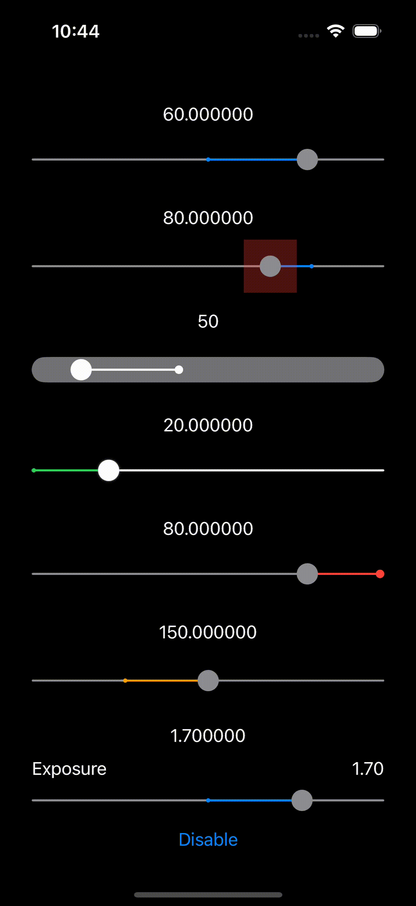

# **SliderView for SwiftUI **
SliderView is an open-source SwiftUI package for a native Slider drop-in replacement. This package provides a variety of customization options such as thumb size, color, guide bar style, tracking bar color, and many more, making it the best choice for your user interface needs.

[](https://developer.apple.com/macOS)
[](https://developer.apple.com/iOS)
[](https://developer.apple.com/macOS)
[](https://developer.apple.com/tvOS)
[](https://www.instagram.com/it.jedi.au)
[](https://developer.apple.com/documentation/swift_packages/package/)
[](https://opensource.org/licenses/MIT)  

## Features

- Super easy to use and lightweight.
- Works as Slider drop-in replacement.
- Set any upper and lower bounds of your slider.
- Opt to increment values discretely or continuously.
- Customize the slider's thumb touch area size, visual size, color, and shadow.
- Style the guide bar with your choice of corner radius, color, and height.
- Define the appearance of the tracking bar, including its color and height.
- Specify Default (value used to set by default on double tap) and Anchor (value used to show a mark on tracking bar by default as a dot) values.
- Easily enable or disable component with visual feedback.
- Intelligent optional Haptic feedback when min, max, default or anchor value is selected.
- Add your own Leading and Trailing views (either or both) for displaying title and selected value.

## Requirements

- iOS 14.0+
- mac OS 11.0+

## Demo


## Swift Package Manager
The Swift Package Manager is a tool for automating the distribution of Swift code and is integrated into the swift compiler. Once you have your Swift package set up, adding `SliderView` as a dependency is as easy as adding it to the dependencies value of your Package.swift.

```swift
dependencies: [
    .package(url: "https://github.com/dev4jam/SliderView.git", .branch("main"))
]
```

## Usage

Firstly, import the `SliderView` package in the file where you want to use it:

```swift
import SwiftUI
import SliderView
```

Then add `SliderView` into your view hierarchy and customize it:

```
struct ContentView: View {
    @State private var value: CGFloat = 2.0

    var body: some View {
        SliderView(
            value: $value,
            range: -3...3,
            increment: .none,
            thumbSize: 20,
            thumbColor: .gray,
            anchorPointSize: 4,
            guideBarCornerRadius: 1,
            guideBarColor: .gray,
            guideBarHeight: 2,
            trackingBarColor: .blue,
            trackingBarHeight: 2,
            shadow: 0,
            shadowColor: .clear,
            disabledColor: .black.opacity(0.3),
            leading: {
              Text("Exposure")
            },
            trailing: {
              Text(String(format: "%.2f", value))
            }
        )
    }
}
```

To further customize the `SliderView`, you can specify other properties as per your needs. Refer to Demo project for more examples.

## Contribution
Contributions to the `SliderView` project are welcome! Feel free to open a new issue or send a pull request, if you happen to find a bug, or would like to add any new features.

## Contact
instagram : [@it.jedi.au](https://www.instagram.com/it.jedi.au)  
email : [it.jedi.au@gmail.com](mailto:it.jedi.au@gmail.com)

## License
`SliderView` is available under the MIT license. See the [LICENSE](LICENSE) file for more info.

